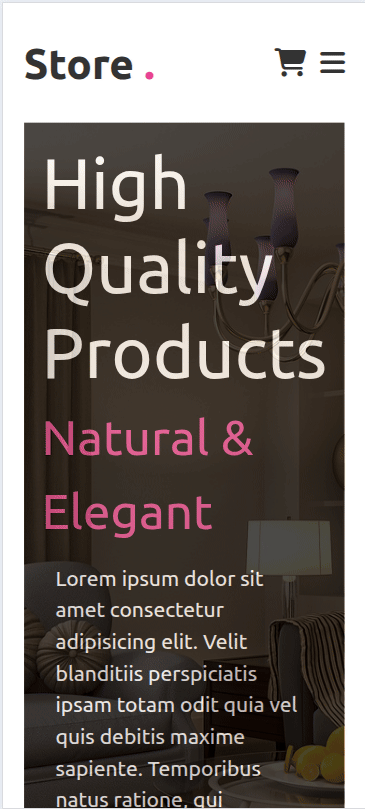

# Forniture E-Comerce 
A responsive and visually appealing landing page for an e-commerce. Built using HTML, CSS, and JavaScript with mobile-first design principles.

## 📱 Responsive Design

Fully responsive layout with mobile navigation support:
- Mobile-friendly navbar with smooth slide-in transition
- Consistent spacing and layout on smaller screens

## 🛠 Technologies Used

- HTML5
- CSS3 (Flexbox, Custom Properties, Media Queries)
- JavaScript (Vanilla)
- Font Awesome (Icons)

## 📸 Screenshots

| Home Preview | Product Preview |
|-----------------|----------------|
|  |  |
